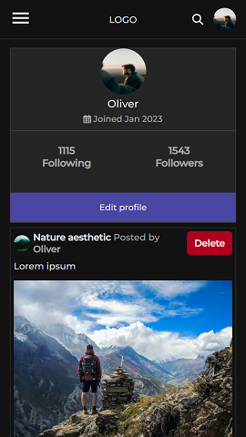

# Rede social

O projeto consiste em uma rede social desenvolvida em Django

## Funcionalidades

- Registrar/Login
- Criar, comentar e curtir postagens
- Seguir outros usuários
- Scroll infinito
- Comunidades

## Screenshots

### Desktop

### Mobile

## Tecnologias utilizadas

- Django
- SQLite
- HTML
- CSS
- Javascript

